# Estructura Actual de Database

Snapshot levantado sobre la base productiva de 4Shine el **20 de marzo de 2026**.

Notas:
- Los conteos de filas usan `pg_stat_user_tables.n_live_tup`, por lo que son **estimados**.
- El diagrama ER de abajo muestra las **relaciones físicas principales** y los cruces más relevantes entre dominios.
- En varios módulos existen también relaciones **lógicas** por columnas `user_id`, `owner_user_id`, `created_by` o similares que hoy no siempre están protegidas por `FOREIGN KEY`.

## Resumen Ejecutivo

| Esquema | Tablas | Rows estimadas | Rol en la plataforma |
|---|---:|---:|---|
| `app_admin` | 5 | 1733 | Branding, revisiones, integraciones y auditoría |
| `app_assessment` | 5 | 9 | Diagnóstico, tests, pilares y sesiones |
| `app_auth` | 7 | 178 | Roles, módulos, permisos, credenciales y refresh sessions |
| `app_core` | 14 | 5 | Usuarios, organizaciones, cohortes y trayectoria |
| `app_learning` | 10 | 20 | Contenidos y workbooks por usuario |
| `app_mentoring` | 12 | 20 | Mentorías del programa, sesiones y marketplace |
| `app_networking` | 12 | 0 | Mensajería, conexiones, jobs y workshops |

## Diagrama ER

```mermaid
erDiagram
  ORGANIZATIONS ||--o{ USERS : organization_id
  USERS ||--|| USER_PROFILES : user_id
  USERS ||--o{ COHORT_MEMBERSHIPS : user_id
  COHORTS ||--o{ COHORT_MEMBERSHIPS : cohort_id
  USERS ||--o{ TRAJECTORY_EVENTS : user_id
  COHORTS ||--o{ TRAJECTORY_EVENTS : cohort_id

  ROLES ||--o{ USER_ROLES : role_code
  ROLES ||--o{ ROLE_MODULE_PERMISSIONS : role_code
  MODULES ||--o{ ROLE_MODULE_PERMISSIONS : module_code

  PILLARS ||--o{ TESTS : pillar_code
  TESTS ||--o{ TEST_ATTEMPTS : test_id
  TEST_ATTEMPTS ||--o{ TEST_ATTEMPT_SCORES : attempt_id
  PILLARS ||--o{ TEST_ATTEMPT_SCORES : pillar_code
  TEST_ATTEMPTS ||--o{ DISCOVERY_SESSIONS : attempt_id

  WORKBOOK_TEMPLATES ||--o{ USER_WORKBOOKS : template_id
  CONTENT_ITEMS ||--o{ CONTENT_ASSIGNMENTS : content_id
  CONTENT_ITEMS ||--o{ CONTENT_COMMENTS : content_id
  CONTENT_COMMENTS ||--o{ CONTENT_COMMENTS : parent_comment_id
  CONTENT_ITEMS ||--o{ CONTENT_LIKES : content_id
  CONTENT_ITEMS ||--o{ CONTENT_PROGRESS : content_id
  CONTENT_ITEMS ||--o{ CONTENT_REVIEWS : content_id
  CONTENT_ITEMS ||--o{ CONTENT_TAGS : content_id
  TAGS ||--o{ CONTENT_TAGS : tag_id

  BRANDING_SETTINGS ||--o{ BRANDING_REVISIONS : branding_id
  BRANDING_REVISIONS ||--o{ BRANDING_REVISIONS : source_revision_id

  MENTORS ||--o{ MENTOR_SPECIALTIES : mentor_user_id
  MENTORS ||--o{ MENTOR_AVAILABILITY : mentor_user_id
  MENTORS ||--o{ MENTOR_OFFERINGS : mentor_user_id
  MENTORS ||--o{ MENTOR_ASSIGNMENTS : mentor_user_id
  MENTOR_ASSIGNMENTS ||--o{ MENTORSHIP_SESSIONS : assignment_id
  MENTORS ||--o{ MENTORSHIP_SESSIONS : mentor_user_id
  MENTORSHIP_SESSIONS ||--o{ SESSION_PARTICIPANTS : session_id
  MENTORSHIP_SESSIONS ||--o{ SESSION_FEEDBACK : session_id
  MENTORSHIP_SESSIONS ||--o{ SESSION_PRIVATE_NOTES : session_id
  PROGRAM_MENTORSHIP_TEMPLATES ||--o{ USER_PROGRAM_MENTORSHIPS : template_code
  MENTORSHIP_SESSIONS ||--o| USER_PROGRAM_MENTORSHIPS : scheduled_session_id
  MENTOR_OFFERINGS ||--o{ ADDITIONAL_MENTORSHIP_ORDERS : offer_id
  MENTORSHIP_SESSIONS ||--o| ADDITIONAL_MENTORSHIP_ORDERS : scheduled_session_id

  CHAT_THREADS ||--o{ MESSAGES : thread_id
  CHAT_THREADS ||--o{ THREAD_PARTICIPANTS : thread_id
  INTEREST_GROUPS ||--o{ GROUP_MEMBERSHIPS : group_id
  JOB_POSTS ||--o{ JOB_APPLICATIONS : job_post_id
  JOB_POSTS ||--o{ JOB_POST_TAGS : job_post_id
  JOB_TAGS ||--o{ JOB_POST_TAGS : tag_id
  WORKSHOPS ||--o{ WORKSHOP_ATTENDEES : workshop_id
```

## Entidades de Negocio Clave

### Núcleo

| Tabla | PK | Columnas clave | Observación |
|---|---|---|---|
| `app_core.users` | `user_id` | `email`, `display_name`, `primary_role`, `organization_id`, `avatar_url` | Tabla central de identidad de negocio |
| `app_core.user_profiles` | `user_id` | `profession`, `industry`, `plan_type`, `seniority_level`, `bio` | Extiende al usuario |
| `app_core.trajectory_events` | `event_id` | `user_id`, `cohort_id`, `title`, `event_type`, `status`, `planned_at`, `completed_at` | Base natural del módulo Trayectoria |

### Assessment / Descubrimiento

| Tabla | PK | Columnas clave | Observación |
|---|---|---|---|
| `app_assessment.tests` | `test_id` | `test_code`, `title`, `pillar_code`, `is_active` | Catálogo de tests |
| `app_assessment.test_attempts` | `attempt_id` | `test_id`, `user_id`, `status`, `started_at`, `completed_at`, `overall_score` | Historial de intentos |
| `app_assessment.discovery_sessions` | `session_id` | `attempt_id`, `user_id`, `answers`, `current_idx`, `completion_percent`, `public_id` | Persistencia del diagnóstico por usuario |

### Aprendizaje

| Tabla | PK | Columnas clave | Observación |
|---|---|---|---|
| `app_learning.content_items` | `content_id` | `scope`, `title`, `content_type`, `category`, `url`, `status`, `competency_metadata` | Biblioteca de contenidos y SCORM |
| `app_learning.workbook_templates` | `template_id` | `workbook_code`, `sequence_no`, `title`, `pillar_code`, `unlock_offset_days` | Catálogo maestro de workbooks |
| `app_learning.user_workbooks` | `workbook_id` | `template_id`, `owner_user_id`, `available_from`, `completion_percent`, `state_payload` | Instancia única de workbook por usuario |

### Mentorías

| Tabla | PK | Columnas clave | Observación |
|---|---|---|---|
| `app_mentoring.program_mentorship_templates` | `template_code` | `sequence_no`, `title`, `phase_code`, `workbook_code`, `suggested_week` | Mentorías incluidas del programa |
| `app_mentoring.user_program_mentorships` | `entitlement_id` | `owner_user_id`, `template_code`, `status`, `scheduled_session_id` | Derecho del líder a mentorías incluidas |
| `app_mentoring.mentor_offerings` | `offer_id` | `mentor_user_id`, `title`, `session_type`, `duration_minutes`, `price_amount` | Marketplace de sesiones adicionales |
| `app_mentoring.mentorship_sessions` | `session_id` | `assignment_id`, `mentor_user_id`, `starts_at`, `ends_at`, `status`, `meeting_url`, `session_origin` | Calendario real de sesiones |
| `app_mentoring.additional_mentorship_orders` | `order_id` | `owner_user_id`, `mentor_user_id`, `offer_id`, `scheduled_session_id`, `status`, `price_amount` | Compra/reserva de sesiones extra |

### Branding / Admin

| Tabla | PK | Columnas clave | Observación |
|---|---|---|---|
| `app_admin.branding_settings` | `branding_id` | `organization_id`, `platform_name`, `primary_color`, `secondary_color`, `accent_color`, `typography`, `border_radius_rem` | Fuente de verdad del branding |
| `app_admin.branding_revisions` | `revision_id` | `branding_id`, `reason`, `changed_fields`, `snapshot`, `change_summary` | Historial de cambios de marca |
| `app_admin.audit_logs` | `audit_id` | `actor_user_id`, `action`, `module_code`, `entity_table`, `entity_id`, `occurred_at` | Traza operativa |

## Catálogo por Esquema

### `app_admin`

Configuración transversal, branding, integraciones y auditoría.

| Tabla | Rows | PK | Relaciones |
|---|---:|---|---|
| `audit_logs` | 1706 | `audit_id` | - |
| `branding_revisions` | 19 | `revision_id` | `branding_id -> app_admin.branding_settings.branding_id` `source_revision_id -> app_admin.branding_revisions.revision_id` |
| `branding_settings` | 1 | `branding_id` | - |
| `integration_configs` | 6 | `integration_id` | - |
| `outbound_email_configs` | 1 | `outbound_email_id` | - |

### `app_assessment`

Diagnósticos, tests, pilares y sesiones de descubrimiento.

| Tabla | Rows | PK | Relaciones |
|---|---:|---|---|
| `discovery_sessions` | 2 | `session_id` | `attempt_id -> app_assessment.test_attempts.attempt_id` |
| `pillars` | 4 | `pillar_code` | - |
| `test_attempt_scores` | 0 | `attempt_id`, `pillar_code` | `attempt_id -> app_assessment.test_attempts.attempt_id` `pillar_code -> app_assessment.pillars.pillar_code` |
| `test_attempts` | 2 | `attempt_id` | `test_id -> app_assessment.tests.test_id` |
| `tests` | 1 | `test_id` | `pillar_code -> app_assessment.pillars.pillar_code` |

### `app_auth`

Acceso, roles, módulos, permisos y sesiones de autenticación.

| Tabla | Rows | PK | Relaciones |
|---|---:|---|---|
| `modules` | 17 | `module_code` | - |
| `refresh_sessions` | 85 | `session_id` | - |
| `role_module_permissions` | 68 | `role_code`, `module_code` | `module_code -> app_auth.modules.module_code` `role_code -> app_auth.roles.role_code` |
| `roles` | 4 | `role_code` | - |
| `user_credentials` | 2 | `user_id` | - |
| `user_policy_acceptances` | 0 | `acceptance_id` | - |
| `user_roles` | 2 | `user_id`, `role_code` | `role_code -> app_auth.roles.role_code` |

### `app_core`

Núcleo de usuarios, organizaciones, cohortes, trayectoria y perfil.

| Tabla | Rows | PK | Relaciones |
|---|---:|---|---|
| `challenges` | 0 | `challenge_id` | `created_by -> app_core.users.user_id` |
| `cohort_memberships` | 0 | `cohort_id`, `user_id` | `cohort_id -> app_core.cohorts.cohort_id` `user_id -> app_core.users.user_id` |
| `cohorts` | 0 | `cohort_id` | `created_by -> app_core.users.user_id` |
| `interests` | 0 | `interest_id` | - |
| `news_updates` | 0 | `news_id` | `created_by -> app_core.users.user_id` |
| `notifications` | 0 | `notification_id` | `user_id -> app_core.users.user_id` |
| `organizations` | 1 | `organization_id` | - |
| `quotes` | 0 | `quote_id` | - |
| `trajectory_events` | 0 | `event_id` | `cohort_id -> app_core.cohorts.cohort_id` `user_id -> app_core.users.user_id` |
| `user_challenges` | 0 | `user_id`, `challenge_id` | `challenge_id -> app_core.challenges.challenge_id` `user_id -> app_core.users.user_id` |
| `user_interests` | 0 | `user_id`, `interest_id` | `interest_id -> app_core.interests.interest_id` `user_id -> app_core.users.user_id` |
| `user_profiles` | 2 | `user_id` | `user_id -> app_core.users.user_id` |
| `user_projects` | 0 | `project_id` | `user_id -> app_core.users.user_id` |
| `users` | 2 | `user_id` | `organization_id -> app_core.organizations.organization_id` |

### `app_learning`

Biblioteca de contenidos y workbooks por usuario.

| Tabla | Rows | PK | Relaciones |
|---|---:|---|---|
| `content_assignments` | 0 | `assignment_id` | `content_id -> app_learning.content_items.content_id` |
| `content_comments` | 0 | `comment_id` | `content_id -> app_learning.content_items.content_id` `parent_comment_id -> app_learning.content_comments.comment_id` |
| `content_items` | 0 | `content_id` | - |
| `content_likes` | 0 | `content_id`, `user_id` | `content_id -> app_learning.content_items.content_id` |
| `content_progress` | 0 | `content_id`, `user_id` | `content_id -> app_learning.content_items.content_id` |
| `content_reviews` | 0 | `review_id` | `content_id -> app_learning.content_items.content_id` |
| `content_tags` | 0 | `content_id`, `tag_id` | `content_id -> app_learning.content_items.content_id` `tag_id -> app_learning.tags.tag_id` |
| `tags` | 0 | `tag_id` | - |
| `user_workbooks` | 10 | `workbook_id` | `template_id -> app_learning.workbook_templates.template_id` |
| `workbook_templates` | 10 | `template_id` | - |

### `app_mentoring`

Mentores, ofertas, mentorías del programa y sesiones adicionales.

| Tabla | Rows | PK | Relaciones |
|---|---:|---|---|
| `additional_mentorship_orders` | 0 | `order_id` | `mentor_user_id -> app_mentoring.mentors.mentor_user_id` `offer_id -> app_mentoring.mentor_offerings.offer_id` `scheduled_session_id -> app_mentoring.mentorship_sessions.session_id` |
| `mentor_assignments` | 0 | `assignment_id` | `mentor_user_id -> app_mentoring.mentors.mentor_user_id` |
| `mentor_availability` | 0 | `availability_id` | `mentor_user_id -> app_mentoring.mentors.mentor_user_id` |
| `mentor_offerings` | 0 | `offer_id` | `mentor_user_id -> app_mentoring.mentors.mentor_user_id` |
| `mentor_specialties` | 0 | `mentor_user_id`, `pillar_code` | `mentor_user_id -> app_mentoring.mentors.mentor_user_id` |
| `mentors` | 0 | `mentor_user_id` | - |
| `mentorship_sessions` | 0 | `session_id` | `assignment_id -> app_mentoring.mentor_assignments.assignment_id` `mentor_user_id -> app_mentoring.mentors.mentor_user_id` |
| `program_mentorship_templates` | 10 | `template_code` | - |
| `session_feedback` | 0 | `feedback_id` | `session_id -> app_mentoring.mentorship_sessions.session_id` |
| `session_participants` | 0 | `session_id`, `user_id` | `session_id -> app_mentoring.mentorship_sessions.session_id` |
| `session_private_notes` | 0 | `note_id` | `mentor_user_id -> app_mentoring.mentors.mentor_user_id` `session_id -> app_mentoring.mentorship_sessions.session_id` |
| `user_program_mentorships` | 10 | `entitlement_id` | `scheduled_session_id -> app_mentoring.mentorship_sessions.session_id` `template_code -> app_mentoring.program_mentorship_templates.template_code` |

### `app_networking`

Mensajería, conexiones, grupos, empleos y workshops.

| Tabla | Rows | PK | Relaciones |
|---|---:|---|---|
| `chat_threads` | 0 | `thread_id` | - |
| `connections` | 0 | `connection_id` | - |
| `group_memberships` | 0 | `group_id`, `user_id` | `group_id -> app_networking.interest_groups.group_id` |
| `interest_groups` | 0 | `group_id` | - |
| `job_applications` | 0 | `application_id` | `job_post_id -> app_networking.job_posts.job_post_id` |
| `job_post_tags` | 0 | `job_post_id`, `tag_id` | `job_post_id -> app_networking.job_posts.job_post_id` `tag_id -> app_networking.job_tags.tag_id` |
| `job_posts` | 0 | `job_post_id` | - |
| `job_tags` | 0 | `tag_id` | - |
| `messages` | 0 | `message_id` | `thread_id -> app_networking.chat_threads.thread_id` |
| `thread_participants` | 0 | `thread_id`, `user_id` | `thread_id -> app_networking.chat_threads.thread_id` |
| `workshop_attendees` | 0 | `workshop_id`, `user_id` | `workshop_id -> app_networking.workshops.workshop_id` |
| `workshops` | 0 | `workshop_id` | - |

## Relaciones Lógicas No Forzadas por FK

Estas relaciones existen en la práctica del modelo, pero hoy no todas están protegidas por una restricción física de `FOREIGN KEY`.

| Tabla | Columnas lógicas |
|---|---|
| `app_assessment.discovery_sessions` | `user_id` |
| `app_assessment.test_attempts` | `user_id` |
| `app_learning.user_workbooks` | `owner_user_id`, `assigned_by` |
| `app_learning.content_items` | `author_user_id`, `created_by`, `approved_by` |
| `app_mentoring.user_program_mentorships` | `owner_user_id` |
| `app_mentoring.additional_mentorship_orders` | `owner_user_id` |
| `app_mentoring.mentor_assignments` | `mentee_user_id`, `assigned_by` |
| `app_networking.connections` | `requester_user_id`, `addressee_user_id` |
| `app_networking.messages` | `sender_user_id` |
| `app_networking.workshops` | `facilitator_user_id`, `created_by` |
| `app_admin.audit_logs` | `actor_user_id` |

## Lectura Técnica

- La base está bien separada por dominios y ya soporta los módulos de `Descubrimiento`, `Aprendizaje`, `Trayectoria` y `Mentorías`.
- `app_core.users` es el centro lógico del modelo, pero varias referencias hacia usuario siguen siendo blandas y no físicas.
- `app_learning` y `app_mentoring` ya están preparados para instancias por usuario, lo cual es consistente con workbooks únicos y mentorías asignadas por líder.
- `app_networking` está estructuralmente listo, pero aún sin datos productivos.
- `app_admin.branding_settings` sí funciona como fuente central de marca para la plataforma.

## Recomendaciones

1. Convertir gradualmente relaciones lógicas críticas a `FOREIGN KEY`, empezando por `user_workbooks.owner_user_id`, `discovery_sessions.user_id` y `user_program_mentorships.owner_user_id`.
2. Agregar índices compuestos en tablas operativas de agenda y progreso, especialmente `mentorship_sessions`, `user_workbooks` y `discovery_sessions`.
3. Definir una convención explícita para `created_by`, `assigned_by`, `approved_by` y `owner_user_id` para que el modelo sea consistente entre módulos.
4. Mantener este documento como snapshot de referencia y regenerarlo al cerrar cambios estructurales relevantes.
